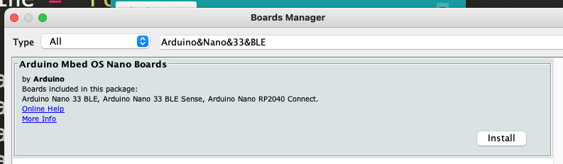

# How do I communicate in Bluetooth with a device?

You are here because you would like to understand Bluetooth communication, and you are planning to use `PyHardwareLibary` to do so.


## What is the Bluetooth Protocol?


## Arduino BLE Sense 33

You can read about setting up the Arduino here:

https://ladvien.com/arduino-nano-33-bluetooth-low-energy-setup/

You need a certain package with Arduino to use the Nano BLE Sense 33:




```python
import asyncio
from bleak import BleakScanner, BleakClient


async def run():
    devices = await BleakScanner.discover()
    for d in devices:
        print(d)

loop = asyncio.get_event_loop()
loop.run_until_complete(run())


address = "55478B5E-47B1-4A69-A758-8A0D02D68049"
MODEL_NBR_UUID = "55478B5E-47B1-4A69-A758-8A0D02D68049"

async def run(address):
    async with BleakClient(address) as client:
        try:
            model_number = await client.read_gatt_char(MODEL_NBR_UUID)
            print("Model Number: {0}".format("".join(map(chr, model_number))))
        except:
            print("No model")

loop = asyncio.get_event_loop()
loop.run_until_complete(run(address))

```


