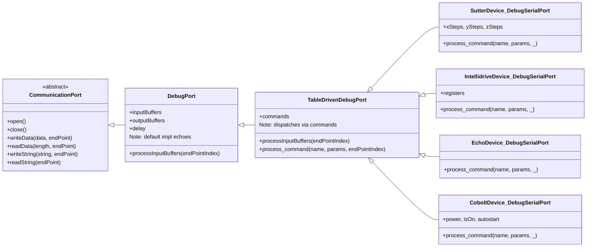
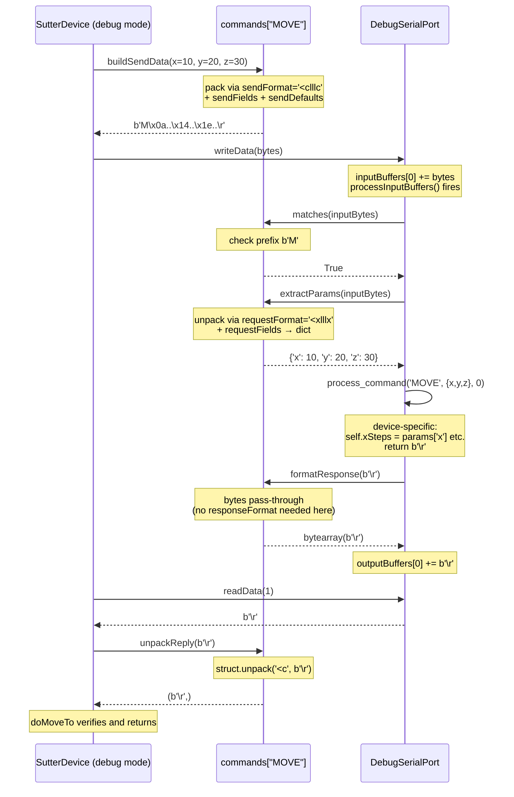

# DebugPort, TableDrivenDebugPort, and the dual-role commands dict

This document explains the debug-port infrastructure used to write **hardware-free mocks** of physical devices, and the recipe for migrating a new device onto it.

If you've ever wanted to:

- run device tests on a CI box that has no hardware attached;
- demo the API without plugging in a real laser/stage/spectrometer;
- iterate on protocol code without the slow round-trip to a real serial port;

…this is the abstraction you want.

## TL;DR

- **`DebugPort`** is a fake port that echoes everything back. Useful when you want to test *port-level behavior* without caring what the bytes mean.
- **`TableDrivenDebugPort`** is a `DebugPort` that dispatches incoming bytes against a dict of `Command` objects and lets you implement device-specific reply logic. Useful when you want to test a *device* without hardware.
- The **same `commands` dict** on a `PhysicalDevice` describes both how it sends commands to the real hardware *and* how its `TableDrivenDebugPort` recognizes those same commands when used as a mock. One declaration, two roles, no drift.

## Class hierarchy



Each device that wants a debug mode declares a nested class:

```python
class SutterDevice(LinearMotionDevice):
    commands = { "MOVE": DataCommand(...), ... }

    class DebugSerialPort(TableDrivenDebugPort):
        def __init__(self):
            super().__init__(commands=SutterDevice.commands)
            self.xSteps = 0
            ...

        def process_command(self, name, params, endPointIndex):
            if name == "MOVE":
                ...
```

## When to pick which base class

| You want to… | Use |
|---|---|
| Verify that a `CommunicationPort` writes/reads bytes correctly | `DebugPort` |
| Test echo-style behavior with arbitrary payloads | `DebugPort` |
| Mock a real device's protocol so tests can exercise its `do*` methods | `TableDrivenDebugPort` subclass |
| Stub *only* the device's high-level methods (no wire protocol) | A `DebugXxxDevice` subclass that overrides `doX` directly — see `DebugLinearMotionDevice`, `DebugRotationDevice` |

## The dual-role `Command` object

Every `Command` (`TextCommand`, `MultilineTextCommand`, `DataCommand`) carries two parallel sets of attributes:

| Role | TextCommand attributes | DataCommand attributes |
|---|---|---|
| **Send** (real device → wire) | `text_format`, `replyPattern`, `alternatePattern` | `data` or `sendFormat`+`sendFields`+`sendDefaults`, `replyDataLength`, `unpackingMask` |
| **Recognize** (mock receives wire bytes) | `matchPattern` (or auto-derived from `text_format`) | `prefix` (or auto-derived from `data[0:1]`), `requestFormat`, `requestFields` |
| **Respond** (mock writes reply) | `responseTemplate` | `responseFormat`, `responseFields` |

The send side and the recognize side describe the **same protocol** from opposite ends — one packs, the other unpacks. Putting them on a single object means the protocol can never drift between the real driver and its mock.

## How a roundtrip works

When a device with `serialNumber="debug"` calls `sendCommand(...)`, the bytes travel through `inputBuffers`, get dispatched by `processInputBuffers`, and the reply comes back through `outputBuffers`. Here's a `SutterDevice.doMoveTo((10, 20, 30))` end-to-end:



Notice that the **same `commands["MOVE"]` object** is consulted four times — twice during send (`buildSendData`, `unpackReply`) and twice during recognize (`matches`/`extractParams` for parsing, `formatResponse` for replying). Add one `DataCommand` to the dict and you've described both halves of the protocol.

## Recipe — getting a new device working with TableDrivenDebugPort

Follow this 7-step checklist. Reference implementation: `motion/sutterdevice.py` (binary protocol) or `motion/intellidrivedevice.py` (text protocol with named groups).

### 1. Subclass the family base **and** `PhysicalDevice`

```python
from hardwarelibrary.physicaldevice import PhysicalDevice
from hardwarelibrary.motion.linearmotiondevice import LinearMotionDevice

class MyDevice(LinearMotionDevice):
    classIdVendor = 0xXXXX
    classIdProduct = 0xYYYY
```

### 2. Declare the `commands` dict as a class attribute

Each entry is a `TextCommand`, `MultilineTextCommand`, or `DataCommand` with **both** the send-side and recognize-side attributes filled in.

For a text protocol:

```python
commands = {
    "GET_REGISTER": TextCommand(
        name="GET_REGISTER",
        # send side:
        text_format="g r{register}\n",
        replyPattern=r"v\s(-?\d+)",
        # recognize side:
        matchPattern=r'g r(?P<register>0x[0-9a-fA-F]+)[\r\n]',
        responseTemplate="v {value}\r"),
}
```

For a binary protocol:

```python
commands = {
    "MOVE": DataCommand(
        name="MOVE", prefix=b'M',
        # send side:
        sendFormat='<clllc',
        sendFields=('header', 'x', 'y', 'z', 'terminator'),
        sendDefaults={'header': b'M', 'terminator': b'\r'},
        replyDataLength=1, unpackingMask='<c',
        # recognize side:
        requestFormat='<xlllx', requestFields=('x', 'y', 'z')),
}
```

Tips:

- Use **named regex groups** (`(?P<name>...)`) in `matchPattern` and matching `{name}` placeholders in `responseTemplate`. `extractParams` returns a dict — far more readable than positional tuples.
- For `DataCommand`, the `x` characters in struct formats are pad bytes — use them to skip the prefix and terminator when unpacking.
- The send-side and recognize-side formats are usually mirror images: `<clllc` to send (pack 3 ints with prefix/terminator), `<xlllx` to receive (skip prefix/terminator, unpack 3 ints).

### 3. Implement `doInitializeDevice` with a sentinel

```python
def doInitializeDevice(self):
    if self.serialNumber == "debug":
        self.port = self.DebugSerialPort()
    else:
        self.port = SerialPort(portPath=...)   # or USBPort, etc.
    self.port.open()
```

### 4. Implement the family-required `do*` methods

Look up the command and call `.send()`:

```python
def doMoveTo(self, position):
    x, y, z = position
    reply = self.sendCommand("MOVE", x=int(x), y=int(y), z=int(z))
    ...
```

Or for a `TextCommand` with reply parsing:

```python
def doGetPower(self) -> float:
    cmd = MyDevice.commands["GET_POWER"]
    cmd.send(port=self.port)
    return float(cmd.matchGroups[0])
```

### 5. Add a nested `DebugSerialPort(TableDrivenDebugPort)`

Inside the device class, **after** the methods:

```python
class DebugSerialPort(TableDrivenDebugPort):
    def __init__(self):
        super().__init__(commands=MyDevice.commands)
        # initialize any mock state:
        self.registers = {}

    def process_command(self, name, params, endPointIndex):
        if name == "GET_REGISTER":
            register = params["register"]
            return {"value": str(self.registers.get(register, 0))}
        elif name == "MOVE":
            self.x, self.y, self.z = params["x"], params["y"], params["z"]
            return b'\r'
        ...
```

`process_command` receives:
- `name`: the matched command's name (string)
- `params`: the parsed parameters — a **dict** if you used named groups / `requestFields`, a **tuple** otherwise
- `endPointIndex`: which endpoint (relevant for multi-endpoint USB devices)

It must return one of:
- `dict` → formatted via `responseTemplate` / `responseFormat`+`responseFields`
- `tuple` → formatted via `responseTemplate` / `responseFormat` positionally
- `bytes` / `bytearray` → returned as-is
- `str` → encoded to UTF-8
- `None` → no reply sent (input is still consumed)

### 6. Export from the family's `__init__.py`

```python
from .mydevice import MyDevice
```

### 7. Add tests

Create `hardwarelibrary/tests/testMyDevice.py`:

```python
import env
import unittest
from hardwarelibrary.mymodule import MyDevice

class TestMyDevice(unittest.TestCase):
    def setUp(self):
        try:
            self.device = MyDevice()           # real hardware
            self.device.initializeDevice()
        except Exception:
            self.skipTest("No MyDevice connected")
    ...

class TestDebugMyDevice(unittest.TestCase):
    def setUp(self):
        self.device = MyDevice(serialNumber="debug")
        self.device.initializeDevice()

    def testDoMoveTo(self):
        self.device.doMoveTo((10, 20, 30))
        self.assertEqual(self.device.doGetPosition(), (10, 20, 30))
```

Follow the established convention: the real-hardware test class **skips** when no hardware is attached; the debug test class **always runs**.

## Edge cases and gotchas

- **Unmatched input is discarded silently** (with a `print("Unrecognized command: ...")`). If a test sends something that doesn't match any command, the input buffer is cleared and no reply is generated — `readData`/`readString` on the device side will time out. That's usually the right signal that your `matchPattern` is wrong.

- **`re.match` anchors at the start.** Patterns like `r'p\?\r'` won't accidentally match `'pa?\r'`. Order of commands in the dict doesn't matter for unambiguous patterns.

- **Auto-derived match patterns.** For `TextCommand`, if you omit `matchPattern`, one is derived from `text_format` by escaping it and replacing `{…}` placeholders with `(.+?)`. For `DataCommand`, if you omit `prefix`, the first byte of `data` is used. The explicit forms exist for when the auto-derivation isn't expressive enough (e.g., you need a regex character class).

- **Reply terminator matters for `readString`.** `CommunicationPort.readString()` reads byte-by-byte until `self.terminator` (default `b'\n'`). If your `responseTemplate` doesn't end with `\n`, the read will time out. `\r\n` works because `\n` is the terminator.

- **`replyDataLength` for `DataCommand`.** Binary replies are read by **fixed length**, not by terminator. Set `replyDataLength` to the exact byte count or you'll either time out (too short) or block (too long).

## Where it's used in this repo

| Device | File | Protocol type |
|---|---|---|
| `SutterDevice` | `motion/sutterdevice.py` | Binary (`DataCommand`) |
| `IntellidriveDevice` | `motion/intellidrivedevice.py` | Text with named groups |
| `EchoDevice` | `echodevice.py` | Text + binary (mixed) |
| `CoboltDevice` | `sources/cobolt.py` | Text |

`IntegraDevice` (`powermeters/integradevice.py`) and `OISpectrometer` (`spectrometers/oceaninsight.py`) use the `commands` dict **without** the table-driven debug port — they still talk to real hardware only. They're candidates for the same migration.

## See also

- `hardwarelibrary/communication/commands.py` — `Command` / `TextCommand` / `DataCommand` source with full docstrings
- `hardwarelibrary/communication/debugport.py` — `DebugPort` / `TableDrivenDebugPort` source
- `hardwarelibrary/tests/testCommandRecognition.py` — unit tests for the `Command` machinery (good for understanding semantics)
- `hardwarelibrary/tests/testTableDrivenDebugPort.py` — three minimal fixture classes that show the pattern stripped of device specifics
- `README-4-New-device-coding-example.md` — the older, human-oriented walkthrough of writing a new driver
