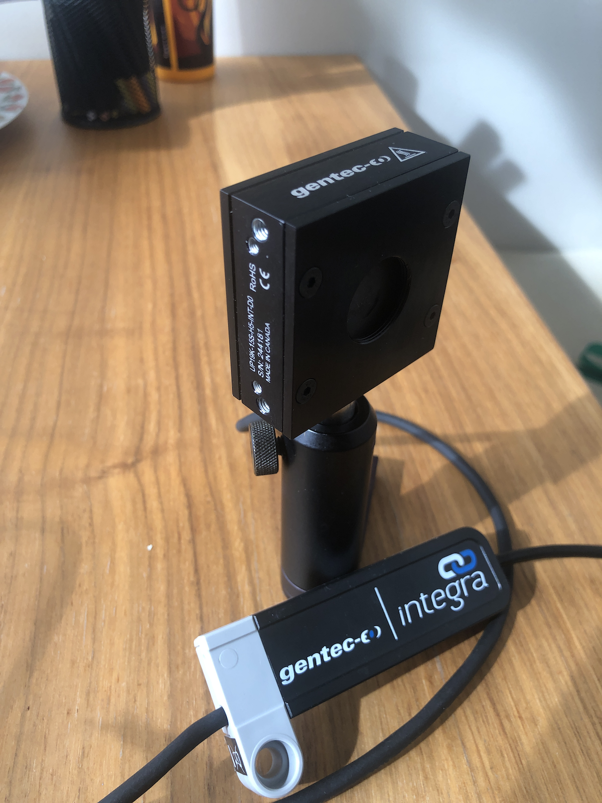
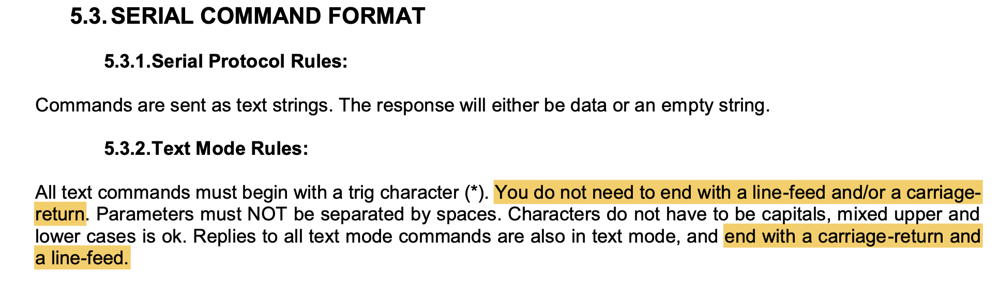
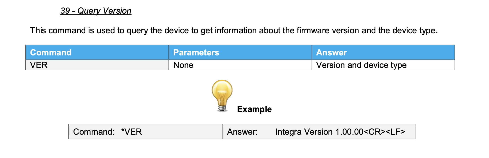

# Coding example

We all want to control devices, and that is why you are here. So how do we do this? Here you will find an example of how I implemented a simple "driver" in Python for a power meter device.

1. We have a device.  Here it will be an Integra Power Meter from Gentec-EO.
2. We look up the **USB Device descriptors** on the USB port to gather information.
3. We find the manual, because it contains the commands we hope to implement, and possibly more information
4. After having identified the interface and endpoints, we communicate we the device


## Gentec-EO, Integra power meter

Gentec-EO is a company from Québec city making tests and measurement devices, including power meters. They market this nice, simple and lightweight power meter called the Integra that connects to the computer via USB:



If we go to the [Product web page](https://www.gentec-eo.com/products/up19k-15s-h5-d0), we find the following information:

1. The device specifications confirming we have the right power meter for the right job.
2. The most important is the [Integra Manual](https://downloads.gentec-eo.com/prod/48fcf131/203008-Manual-Integra-V3.3.pdf), which we will use to the fullest extent.
3. [Software](https://downloads.gentec-eo.com/prod/694fceed/PC-Gentec-EO-V2.01.12.exe) (Windows-only) for displaying power.
4. [Drivers](https://downloads.gentec-eo.com/prod/15d21605/Gentec-EO-Drivers-V2.00.00.exe) (surprisingly Windows-only) for making the device work as a serial port on Windows.
   1. It does tell us that the device can be serialized (that is, we will only need a simple two-way "port" to communicate with it) on macOS and Linux, because it can be serialized on Windows.
   2. The driver is generic and mostly unidentified, so I was unable to find the macOS and Linux versions, but we won't need it anyway
5. Firmware updates for the devices.  Interesting.

## USB Descriptors of the device

Running our usual USB device finder code:

```python
import usb.core
import usb.util

for bus in usb.busses():
    for device in bus.devices:
        if device != None:
            usbDevice = usb.core.find(idVendor=device.idVendor, 
                                      idProduct=device.idProduct)
            print(usbDevice)

```

we get find the following descriptor for the Integra, which I commented:

```shell
DEVICE ID 1ad5:0300 on Bus 020 Address 005 =================
 bLength                :   0x12 (18 bytes)
 bDescriptorType        :    0x1 Device
 bcdUSB                 :  0x200 USB 2.0
 bDeviceClass           :    0x0 Specified at interface
 bDeviceSubClass        :    0x0
 bDeviceProtocol        :    0x0
 bMaxPacketSize0        :    0x8 (8 bytes)
 idVendor               : 0x1ad5             # idVendor unknown to https://devicehunt.com/all-usb-vendors
 idProduct              : 0x0300             # internal to vendor
 bcdDevice              :  0x112 Device 1.12
 iManufacturer          :    0x1 Gentec-EO Inc.            
 iProduct               :    0x2 Integra USB Meter
 iSerialNumber          :    0x3 E8AF996F08001B00
 bNumConfigurations     :    0x1             # Only 1 configuration
  CONFIGURATION 1: 100 mA ==================================
   bLength              :    0x9 (9 bytes)
   bDescriptorType      :    0x2 Configuration
   wTotalLength         :   0x35 (53 bytes)
   bNumInterfaces       :    0x1             # Only 1 interface
   bConfigurationValue  :    0x1
   iConfiguration       :    0x4 HID Interface
   bmAttributes         :   0xa0 Bus Powered, Remote Wakeup
   bMaxPower            :   0x32 (100 mA)
    INTERFACE 0: CDC Communication =========================
     bLength            :    0x9 (9 bytes)
     bDescriptorType    :    0x4 Interface
     bInterfaceNumber   :    0x0
     bAlternateSetting  :    0x0
     bNumEndpoints      :    0x3             # 3 endpoints. We need to figure out which ones are for us
     bInterfaceClass    :    0x2 CDC Communication      # This is general indication it can be serialized
     bInterfaceSubClass :    0x2
     bInterfaceProtocol :    0x1
     iInterface         :    0x5 Virtual COM port (CDC) # This is a very explicit indication that it 
                                                        # can be serialized
      ENDPOINT 0x82: Interrupt IN ========================== # Interrupt IN, that can't be our 
       bLength          :    0x7 (7 bytes)                   # serial input port, they are usually bulk
       bDescriptorType  :    0x5 Endpoint
       bEndpointAddress :   0x82 IN
       bmAttributes     :    0x3 Interrupt
       wMaxPacketSize   :   0x40 (64 bytes)
       bInterval        :   0xff
      ENDPOINT 0x3: Bulk OUT =============================== # Bulk OUT: this is our output endpoint
       bLength          :    0x7 (7 bytes)
       bDescriptorType  :    0x5 Endpoint
       bEndpointAddress :    0x3 OUT
       bmAttributes     :    0x2 Bulk
       wMaxPacketSize   :   0x40 (64 bytes)
       bInterval        :   0xff
      ENDPOINT 0x83: Bulk IN =============================== # Bulk IN: this is our input endpoint
       bLength          :    0x7 (7 bytes)
       bDescriptorType  :    0x5 Endpoint
       bEndpointAddress :   0x83 IN
       bmAttributes     :    0x2 Bulk
       wMaxPacketSize   :   0x40 (64 bytes)
       bInterval        :   0xff

```

We don't need a *driver* to read the USB descriptors: we only need access to the USB port. A driver will take the device, configure it, pick and interface and expose it one way or another to the system so that other applications can communicate with it simply.  In this case, the Windows driver claims the device and then expose it as a COM port. We can check to see if the device is serialized on macOS in the `/dev/` directory, but `ls -l /dev/cu*` in the terminal returns nothing, so we do not have the equivalent driver on macOS Big Sur by default. If we insisted to find out, we would find a Windows machine, install the driver downloaded from Gentec-EO, and read its `.INF` file (somewhere) to find the detailed information about the driver, then download and install on macOS.

So from the descriptor above, we find everything we need to start experimenting with the device: 1 configuration, 1 interface and two bulk OUT/IN endpoints.

## Manual and commands

The manual has all the information we need in terms of commands that the device accepts.  They are mostly text commands (ASCII), and the manual explains the structure:



A carriage return is `\r` and a linefeed is `\n`.  [That we need to read both at the end like a typewriter from 1965](https://www.hanselman.com/blog/carriage-returns-and-line-feeds-will-ultimately-bite-you-some-git-tips) is an interesting story. From this documentation, I understand a command would always reply at least with an empty string to confirm it has recevied the command (but we will see that is not the case).

  The simplest command we will try to confirm we can talk to the device is the VERSION command, and that's the one we will be implementing first to test the communication:



## First communication with the Integra device

Let's try the simplest script to communicate with our USB device, send a command, and read a reply:

```python
# This script is called firstIntegraCommunication.py
import usb.core
import usb.util
from array import array 

device = usb.core.find(idVendor=0x1ad5, idProduct=0x0300)      # Find our device
if device is None:
    raise IOError("Can't find device")

device.set_configuration()                                     # First (and only) configuration
configuration = device.get_active_configuration()              # Confirm configuration
interface = configuration[(0,0)]                               # Get the first interface, no alternate

interruptEndpoint = interface[0]                               # Not useful
outputEndpoint = interface[1]                                  # Our output bulk OUT
inputEndpoint = interface[2]                                   # Our input bulk IN

outputEndpoint.write("*VER")                                   # The command, no '\r' or '\n'

buffer = array('B',[0]*inputEndpoint.wMaxPacketSize)           # Buffer with maximum size
bytesRead = inputEndpoint.read(size_or_buffer=buffer)          # Read and get number of bytes read
print( bytearray(buffer[:bytesRead]).decode(encoding='utf-8')) # Buffer is not resized, we do it ourselves
```

We get the following output, confirming we are doing this right:

```shell
(base) dccote@DCC-dccote tests % python firstIntegraCommunication.py
Integra Version 2.00.08
```

From here, it looks like it is just a very simple repetition of this with all the known commands we want to support (see Integra User_Manual_Integra_V3.0, page 10). In particular, `*CVU` is "Get current power value", which is probably sufficient for many applications. However, there is also a calibration wavelength that will help the device convert the exact internal value (in mV) to actual power (mW). By default, it is 1064 nm, so we may want to change that. This may appear good enough, and may be for your needs, but is it really that difficult to do more and build on other classes that can do the work for us?

## Unit testing a device

We have not really been methodical yet: we have written a very simple script to try one command, and we confirmed that it worked. But we can do better with a strategy called _Unit Testing_ .

We should not really care about the details of how we communicate with a device: **USB**, **Serial**, **RS-232**, **Ethernet**, etc... : as long as we have a bidirectional communication channel, then why should we? In addition, using `PyUSB` is great, but will we always be using PyUSB? What if it stops being supported? Since `PyHardwareLibrary`  is an application-oriented library, we have our own  group of ports available (`CommunicationPort`, `USBPort`, `SerialPort`, etc...), and they all derive from `CommunicationPort`. They all share common functionalities that are always required when having a dialog with a device. In fact, I am using these developments to refine their behaviour and their API. A discussion of the details of [`CommunicationPort`is](README-Communication ports.md) available [here](README-Communication ports.md), but we will simply use the `USBPort` class immediately to focus on the device, not the communication details. 

The present documentation will be completed with an explanation of the `unittests` that were created for the device:

```python
import env # modifies path
import unittest
import time

from hardwarelibrary.communication import USBPort, TextCommand
import usb.core

class TestIntegraPort(unittest.TestCase):
    port = None
    def setUp(self):
        self.port = USBPort(idVendor=0x1ad5, idProduct=0x0300, interfaceNumber=0, defaultEndPoints=(1,2))
    def tearDown(self):
        self.port.close()

    def testCreate(self):
        self.assertIsNotNone(self.port)

    def testReadPower(self):
        self.port.writeData(data=b"*CVU\r")
        reply = self.port.readString()
        self.assertIsNotNone(reply)
        self.assertTrue(float(reply) != 0)

    def testValidateCommands(self):
        commands = [b'*VEr',b'*STS', b'ST2', b'*CVU',b'*GWL',b'*GAN',b'*GZO',b'*GAS',b'*GCR',b'SSU',b'SSD',b'*DVS']
        for command in commands:
            self.port.writeData(data=command)
            try:
                if command != b'*DVS':
                    reply = self.port.readString()
                    self.assertIsNotNone(reply)
                else:
                    while True:
                        try:
                            reply = self.port.readString()
                            self.assertIsNotNone(reply)
                        except:
                            break
            except:
                print("Nothing returned for command {0}".format(command))

[... and more .... ] 
                
if __name__ == '__main__':
    unittest.main()

```


