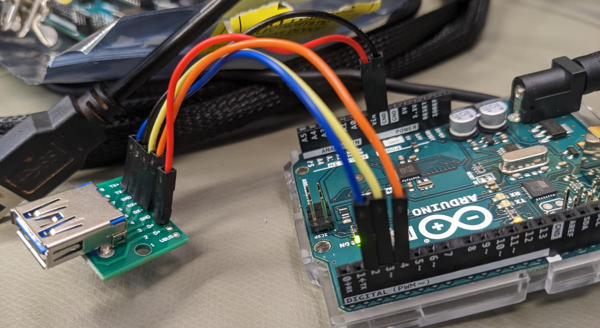

# driverAI25

Arduino Uno driver to control the Uniblitz AI25 Auto Iris. Requires a 12V 2A power supply (2.1 x 5.5 mm barrel jack).

You need to install `NeoSWSerial` in the Arduino IDE Library Manager.

Reference manual: https://www.uniblitz.com/wp-content/uploads/2021/03/ai25-direct-control-v1-2.pdf

Pinout:

