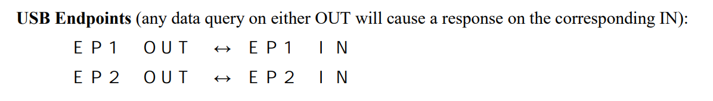

# Supporting the Ocean Insight QEPro

The QE Pro from Ocean Insight is a spectacular spectrometer with great sensitivity for Raman.  My Lab bought one recently.  Not cheap, but worth it. It so happens that it also uses the OceanView software, which I strongly believe was written on a friday night before a long week-end by a bunch of monkeys on crack.  I will therefore try to integrate it to my `OISpectrometer` class in `PyHardwareLibrary`.

I am chronicling the story of how I will end up supporting the QE Pro.  This will provide an idea of the process to whoever is hoping to the same with another device.

### May 3rd 2021

#### Manual

First thing: get the OEM manual, where all the commands are written.  I already have the OEM from all the other spectrometers (USB2000, USB4000, etc...) but as much as they feel similar, there are differences.  I could not find the manual on Ocean Insight's web site.  I could not find it on google.  I sent a Technical Request via the web site. I got a reply within 24 hours with the manuals, which are not made public by default anymore. I saved them in the `manuals` section of `PyHardwareLibrary`.

A quick look shows it will be a significant undertaking because the structure of commands has changed completely from the USB2000 and USB4000:


The PDF version I have is corrupted (Acrobat and Preview on macOS).


On windows I was able to read the information partially but sufficiently to understand that I did not have more info about endpoints:



So contrary to other versions for other spectrometers, the manual appears a bit incomplete with no discussion on endpoints. Other manuals did specifically mention endpoints and where commands needed to be sent. I will probably need to figure this out by trial and error.

The application aspects of the protocol are well documented:


#### Protocol and message layout information

We send messages which are of the form:


​     

#### USB information

The manual says:


I connected the device on a computer which had `PyHardwareLibrary` installed, and I ran `print(usb.core.find(idVendor=0x2457))`. I obtained the complete **USB Descriptor**:

```shell
DEVICE ID 2457:4004 on Bus 001 Address 025 =================
 bLength                :   0x12 (18 bytes)
 bDescriptorType        :    0x1 Device
 bcdUSB                 :  0x200 USB 2.0
 bDeviceClass           :    0x0 Specified at interface
 bDeviceSubClass        :    0x0
 bDeviceProtocol        :    0x0
 bMaxPacketSize0        :   0x40 (64 bytes)
 idVendor               : 0x2457                            # idVendor
 idProduct              : 0x4004                            # idProduct
 bcdDevice              :   0x67 Device 0.67
 iManufacturer          :    0x1 Ocean Optics               # This is our device
 iProduct               :    0x2 QE-PRO                     #
 iSerialNumber          :    0x3 QEP03738                   # A unique serial number, useful
 bNumConfigurations     :    0x1                            # Only one configuration
  CONFIGURATION 1: 100 mA ==================================
   bLength              :    0x9 (9 bytes)
   bDescriptorType      :    0x2 Configuration
   wTotalLength         :   0x2e (46 bytes)
   bNumInterfaces       :    0x1                            # Only one interface
   bConfigurationValue  :    0x1
   iConfiguration       :    0x0
   bmAttributes         :   0xc0 Self Powered
   bMaxPower            :   0x32 (100 mA)
    INTERFACE 0: Vendor Specific ===========================
     bLength            :    0x9 (9 bytes)
     bDescriptorType    :    0x4 Interface
     bInterfaceNumber   :    0x0
     bAlternateSetting  :    0x0
     bNumEndpoints      :    0x4
     bInterfaceClass    :   0xff Vendor Specific             # No driver should take ownership, we're fine
     bInterfaceSubClass :    0x0
     bInterfaceProtocol :    0x0
     iInterface         :    0x4 MSFT100L                    
      ENDPOINT 0x1: Bulk OUT =============================== # Two groups of bulk input-output endpoints
       bLength          :    0x7 (7 bytes)                   # as expected.
       bDescriptorType  :    0x5 Endpoint
       bEndpointAddress :    0x1 OUT
       bmAttributes     :    0x2 Bulk                        # BULK type, which is what we expected
       wMaxPacketSize   :   0x40 (64 bytes)                  # Small packet size
       bInterval        :    0x0
      ENDPOINT 0x81: Bulk IN ===============================
       bLength          :    0x7 (7 bytes)
       bDescriptorType  :    0x5 Endpoint
       bEndpointAddress :   0x81 IN
       bmAttributes     :    0x2 Bulk
       wMaxPacketSize   :   0x40 (64 bytes)
       bInterval        :    0x0
      ENDPOINT 0x2: Bulk OUT ===============================
       bLength          :    0x7 (7 bytes)
       bDescriptorType  :    0x5 Endpoint
       bEndpointAddress :    0x2 OUT
       bmAttributes     :    0x2 Bulk
       wMaxPacketSize   :   0x40 (64 bytes)
       bInterval        :    0x0
      ENDPOINT 0x82: Bulk IN ===============================
       bLength          :    0x7 (7 bytes)
       bDescriptorType  :    0x5 Endpoint
       bEndpointAddress :   0x82 IN
       bmAttributes     :    0x2 Bulk
       wMaxPacketSize   :   0x40 (64 bytes)
       bInterval        :    0x0
```


So configuring the USB device should be very straightforward: first and only config, first and only interface.


